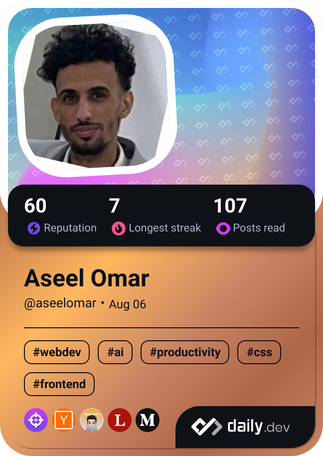

# Hi there, I'm Aseel Omar! 👋
Welcome to my GitHub profile! I’m a passionate **Front-End Web Developer** and a dedicated **Computer Science** student, committed to creating engaging and user-friendly web experiences.

## 🌟 About Me
- 💻 I’m currently working on building responsive websites and enhancing my skills in **HTML**, **CSS**, and **JavaScript**.
- 🚀 I love transforming ideas into reality through clean and efficient code.
- 🌱 I’m always learning new technologies and frameworks to stay up-to-date in the fast-paced world of web development.

## 💬 Let’s Connect!
- 🤝 I’m eager to collaborate on **front-end development projects** or share insights on web technologies.
- 🧠 Have questions about **web design**, **coding**, or **computer science**? Feel free to reach out!

## 🌐 Find Me:
- LinkedIn: [Aseel Omar](https://www.linkedin.com/in/aseelomar)
- GitHub: [aseelomar750](https://github.com/aseelomar750)

⚡ **Fun Fact**: I started coding at the age of 15, and I’ve been fascinated by technology ever since!

